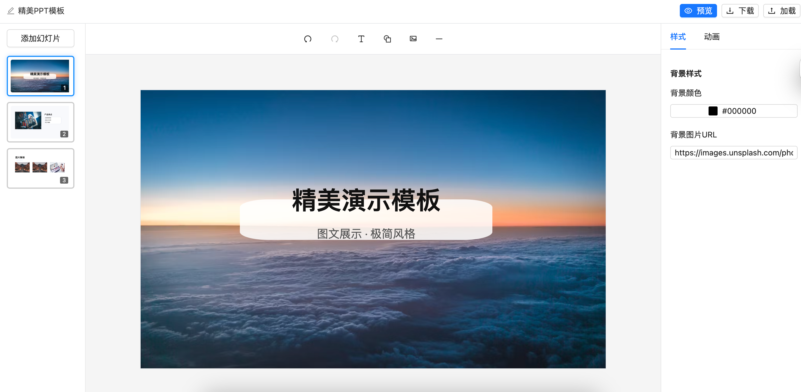

# web-ppt

一个开源的在线 PPT 编辑器，支持添加文本/图片/形状/线条、拖拽/缩放/旋转、撤销/重做等功能。技术栈基于 React、Umi、Ant Design、Zustand、zundo、SVG/Canvas。



## 特性亮点
- 可视化编辑：元素的选择框、控制点、旋转柄，支持拖拽/缩放/旋转
- 统一元素模型：文本/图片/SVG 形状/线条均用同一数据结构 `PPTElement`
- 状态管理：Zustand 管理全局状态，zundo 提供撤销/重做的时间旅行能力
- 画布复用：侧栏缩略图直接复用 `Canvas` 组件整体缩放，视觉一致且维护成本低
- 背景样式：每张幻灯片支持背景色和背景图片 URL
- 属性面板：未选中元素时可编辑画布背景；选中元素时可编辑宽高、位置和样式
- 图片上传：使用浏览器本地预览 URL 即时插入
- 导出 PPT：仓库中已有 `pptxgenjs` 映射示例，可进一步完善完整导出

## 技术栈
- React + Umi（脚手架与工程化）
- Ant Design（UI 组件）
- Zustand（全局状态） + zundo（撤销/重做）
- SVG/Canvas（图形与控制点渲染）
- pptxgenjs（导出 PPT 的基础能力）

## 快速开始
1. 进入前端目录并安装依赖：
   ```bash
   cd front-end
   npm install
   ```
2. 启动开发服务：
   ```bash
   npm run dev
   ```
3. 打开浏览器访问：
   - `http://localhost:8000`

## 主要功能与使用说明
- 添加元素：顶部工具栏支持插入文本、形状、图片、线条
- 编辑文本：点击选中后即可直接编辑，失焦自动写回到状态
- 拖拽与缩放：选中元素出现控制点，拖拽移动、拉伸即可调整
- 旋转：拖拽旋转柄进行旋转
- 背景：在未选中元素时，右侧属性面板可设置背景颜色与图片 URL
- 缩略图：侧栏缩略图与主画布渲染一致，复用同一 `Canvas` 组件，通过整体缩放实现
- 撤销/重做：使用顶部的撤销/重做按钮；或在画布中使用组合键（如复制/粘贴）

## 键盘操作（部分）
- 删除：Delete
- 复制：Ctrl/Cmd + C
- 粘贴：Ctrl/Cmd + V

## 核心目录结构
```
web-ppt/
├── front-end/
│   ├── src/
│   │   ├── components/
│   │   │   ├── Canvas/            # 主画布，支持 embedded + scale（缩略图复用）
│   │   │   ├── ElementRenderer/   # 文本/图片/形状/线条统一渲染与交互
│   │   │   ├── SlideList/         # 幻灯片缩略图列表
│   │   │   ├── PropertyPanel/     # 属性面板：背景/元素属性
│   │   │   └── CanvasHeader/      # 顶部工具栏：撤销/重做、插入操作
│   │   ├── stores/
│   │   │   └── presentationStore.ts  # Zustand + zundo 状态管理
│   │   ├── types/
│   │   │   └── presentation.ts       # Slide、PPTElement、样式类型定义
│   │   └── pages/、utils/ ...
└── images/
    └── demo1.png
```

## 设计要点
- 数据模型统一：`content` 字段在文本/图片/形状三类中分别承载文本值、图片 src、形状类型，减少渲染分支
- 交互解耦：`ElementRenderer` 聚焦元素交互与渲染；`Canvas` 负责容器与事件（包括嵌入缩略图模式）
- 时间旅行：通过 zundo 的 `temporal` 包装 store，低成本接入撤销/重做
- 缩略图方案：复用主画布整体缩放（禁用交互），避免维护两套渲染逻辑

## 贡献
欢迎提交 Issue 或 PR：
- Fork 本仓库并创建分支
- 完成改动后发起 Pull Request，描述变更与动机
- 代码风格尽量保持与现有实现一致，聚焦单一改动

## 许可协议
本项目使用 MIT License，详见根目录 `LICENSE` 文件。

## Roadmap
1. 删除幻灯片
1. 动画通过上下键切换（目前只能点击）
1. 形状代码统一、分类
1. 文字可配置属性 样式修改，下拉框不好看
1. 预览按钮替换为播放icon、上传下载替换为icon
1. 切换幻灯片增加动画效果
1. 展示元素动画数量
1. 选中元素效果优化
1. 支持插入表格、图标
1. 支持插入公式
1. 支持插入音频、视频
1. 吸附线
1. 播放支持当前页、从头开始
1. 增加模版库，可以导入模板库